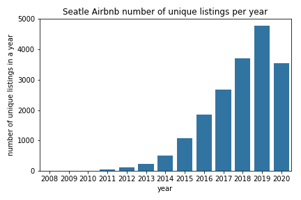

# Write a Data Science Blog

### Table of Contents

1. [Installation](#installation)
2. [Project Motivation](#motivation)
3. [File Descriptions](#files)
4. [Datasets](#datasets)
5. [Results](#results)

## Installation 

There should be no necessary libraries to run the code here beyond the Anaconda distribution of Python.  The code should run with no issues using Python versions 3.*.

## Project Motivation

Based on Cross-Industry Standard Process of Data Mining (CRISP-DM), we will investigate the Seattle's Airbnb datasets to answer the following questions:

- Does the price spikes in the busiest time of the year?
- Is there any trend in Airbnb listings and total visitors? And,
- How well can we predict a price of Seattle Airbnb listings?

## File Descriptions 

 - **airbnb_seattle.ipynb** - Contains all the analysis for the Seattle Airbnb datasets

## Datasets  

AirBnB has provide us three [dataset](http://insideairbnb.com/get-the-data.html) from Seattle:

- **listings.csv** - contains the detailed information about the places, locations, host details, amenities, charges, etc.
- **calender.csv** - has the information regarding all the bookings made so far.
- **reviews.csv** - contains summary review of listings.

## Results

Some of the key observations are:

- The busiest time of the year to visit Seattle is estimated to be middle of Summer, that is, the months of July and August.
- Also, it is been noticed that the prices does get high during the peak months.

- Both number of visitor and number of listings are exponentially increasing from 2008 to 2019.

- We can predict the price in R2 score 0.674 with Random Forest model.

- Regarding the Random Forest model, important features for price prediction is as follows:
    - number of bedrooms, bathrooms, people it can accommodate along with the guests included and/or extra people;
    - total price also involves the maintenance charges such cleaning fee and security deposit.
    - The host qualities are also important like number of host's listings and host acceptance rate.
    - The pricing might depend on reviews and locations.
    
    

Read the Medium blog post on the same,[here](https://medium.com/@cb.brijeshchandra/a-glimpse-of-listings-trend-and-price-spike-in-seattles-airbnb-ba744bf23ee9?sk=4c84a3c0ae80adcae39af32171afb6a4).
